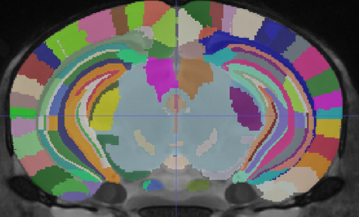
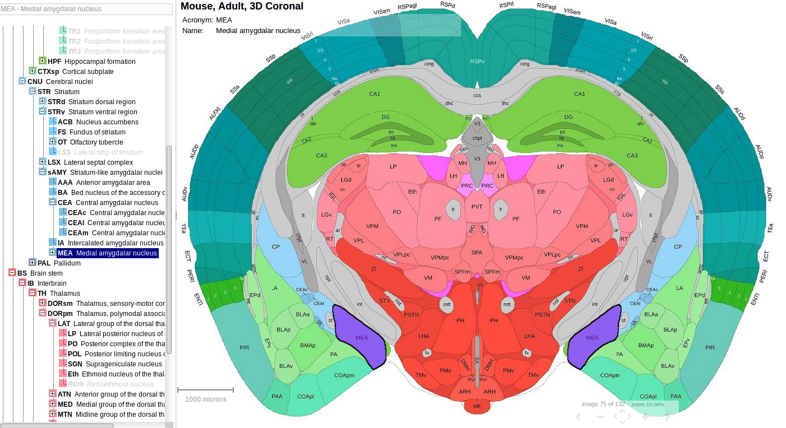

<style>
.caption {
    font-weight: bold
}
</style>

<script>
$("
</script>

```{r}
## Figure counter https://stackoverflow.com/questions/13848137/figure-captions-references-using-knitr-and-markdown-to-html
fig <- local({
    i <- 0
    ref <- list()
    list(
        cap=function(refName, text) {
            i <<- i + 1
            ref[[refName]] <<- i
            paste("Figure ", i, ": ", text, sep="")
        },
        ref=function(refName) {
            ref[[refName]]
        })
})
```

## Introduction

Traditional approaches to analyzing brain anatomy focus on attempting to localize
the brain regions associated with a given covariate. Particularly in the study of disease
or in drug development it is useful to be able to state that a given disease or drug 
has an effect on brain anatomy at a specific location. In this document we're going to evaluate 
simple hierarchical models and a novel model termed the effect diffusion tree at
identifying where in the brain effects are occurring. All code for this analysis 
can be viewed either by opening individual code sections by clicking the 
`code` button to the right of the screen, or opened globally with the `code` menu
in the top right corner using the `Show all code` button.

## Brain mapping

To facilitate analysis and discussion of location within the brain, anatomy is often 
summarized down to a collection of structures via an atlas, defined by expert 
anatomists. An atlas partitions the brain into non-overlapping structures, much the 
way a map might partition a country into states or provinces. This has benefits in
reducing measurement noise by aggregating observations within a region, and by providing
a vocabulary for describing where in the brain an effect occurs [@evans2012brain].

Once structures have been defined, many different properties can be measured.
Examples range from the amount of gene expression to the geometric properties of the 
structure depending on the research question. In this analysis, we're
going to focus on the volume of each structure. In our lab volumetric data is automatically
derived from magnetic resonance images (MRI) using an automatic labelling technique
called MAGeT [@chakravarty2013performing].

Regions are defined by anatomists typically by visible boundaries and shared development.
Our lab predominantly works with mouse MRI and over the years has collaboratively produced 
one of the most detailed high resolution MRI atlases of the mouse brain [@Dorr:2008jc; @Ullmann:2013jf
; @Richards:2011jh; with additional modification by Qiu and Egan]. 

<br>

<p class="caption">`r fig$cap("dsurqe", "The Dorr-Steadman-Ullman-Richards-Egan-Qiu (DSURQE) atlas illustrated on an average mouse brain MRI. Colours indicate distinct structures, the DSURQE atlas identifies 336 structures.")`
</p>
<br>

We use this atlas for most of our analyses, this involves summarizing our measures within
region, and reporting regions where there is evidence for an effect of interest. It has
been increasingly unsatisfying for us to be stuck with these exact structures, and so
we've begun to consider our structures as part of a brain taxonomy tree.

## Brain Taxonomy Trees

From the perspective of shared 
development, it is natural to consider the structures in an atlas as the leaves of 
a taxonomy tree. Parent nodes in the tree indicate collections of structures with 
shared development. These higher order structures are also useful for defining the location
of effects. Conveniently for us, a large brain imaging group --
the Allen Brain Institute (ABI) -- has organized their mouse brain histological atlas in just 
such a way [@lein2007genome]. 

<br>

<p class="caption">`r fig$cap("abi", "A screenshot of the Allen Mouse Brain Atlas indicating distinct structures as identified by histology. Note the hierarchical organization present on the left.")`
</p>
<br>

The Allen brain taxonomy tree defines structure relations as a recursive subdivison of the
brain. The root node of the tree is the whole brain, the first division is by tissue type,
dividing the brain into grey and white matter. The grey matter is subdivided into cerebrum
and cerebellum, and this subdivision process continues until the the structures cannot
be further separated into discernible parts. These terminal (leaf) structures are roughly
equivalent to the structures in our MRI atlas. By unifing our nomenclature to match the Allen 
structures, we can combine our MRI atlas with their taxonomy tree. This allows us to divide the 
mouse brain into a hierarchy of structures. This gives us a vocabularly for higher-order structures 
and additional information about structure relatedness.

## The problem

Historically, each region has been treated as essentially independent. Individuals
have their brains characterized with MRI, the brains are then aligned to an atlas
and the volumes for each region of each subject's brain are measured. The volumes
at each structure are then analyzed with separate linear models.

There are some problems with this approach:

1. Regions are not independent, proximity in space or similarity by development
  cause regions to receive similar genetic and environmental effects.
1. Regions are not homogeneous, the structure volume effects variance, with small
  structures having high noise
1. Partitioning effort isn't uniform across the brain. "Interesting regions" get 
   subdivided into smaller regions. 
1. Regions may be too small for reliable measurement.

We aim to improve on this situation. With our hierarchy tree in hand we can:

- Pool information between structures.
- Use structure taxonomy information to guide the pooling.
- Use results to decide when small structures should be merged to
  improve sensitivity.
- Localize effects to taxonomic origins, possibly giving hints
  to when an effect occurs developmentally.
- Fit everything with Stan.

Bayesian models have been used in neuroimaging for decades, although
the typical focus of these models is either to replace the per structure
linear model with a bayesian model [@friston2002classicalA; @friston2002classicalB;
@woolrich2009bayesian] or to induce spatial dependence across the brain 
[@siden2017fast; @penny2005bayesian]. 
The closest approach to ours is that of Bowman et al [-@bowman2008bayesian], where they
perform a multi-step modelling approach with per voxel (3D pixel) linear modelling 
followed by hierarchical modelling of the coefficients within and between structures. No
other approach, to our knowledge, has attempted to model additional taxonomic organization of
the brain.

## The Models

In order to accomplish our goals, we're going to try three different
bayesian models that will encourage pooling between structures.

1. A standard hierarchical model fit with `rstanarm`'s `stan_lmer` function.
   With pooling between all structures, regardless of position in the brain
   taxonomy.
1. A hierarchical model fit with `rstanarm` that incorporates taxonomy information,
   by pooling effects across parent structures.
1. A tree based model where effects diffuse down the tree as a gaussian
   random walk. 
   
This third model we've termed the effect diffusion tree. In this model,
the covariate effect at each child node is the effect at their parent plus 
some gaussian noise. Encouraging effects to pool by ancestry. It is
a small change to the model used in `stan_lmer`. The distinction will be
explained below. 

An example model we'd like to fit (using either `stan_lmer` or 
the effect diffusion tree) is something of the form: 

`y ~ grp + (grp | structure) + (1 | individual)`

Where `y` is our volumes, `grp` is a grouping covariate of interest,
`structure` is the brain structure, and `individual` is the mouse. We're
claiming that the effect of group depends on the structure of interest with
pooling toward the mean, and a random intercept for each mouse mostly to account
for brain size.

For simplicity we will assume there are two groups.

This model amounts to 

$$ y_{is} = \boldsymbol{\beta} \mathbf{x}_i^t + \boldsymbol{\beta}_{s} \mathbf{x}_i^t  + r_i + \epsilon_{is}$$

with $i$ indexing individuals, $x$ indexing groups, and $s$
indexing structures. Here $x$ is a two component vector, one for the
intercept, and one for the group. Both $\boldsymbol{\beta}$ and $\boldsymbol{\beta}_s$ 
are two component vectors, with intercept and group coefficients, and $r_i$ is a 
scalar with the per individual intercept. All $\epsilon$'s used in
this document represent independent gaussian noise.

The group specific parameters $\beta_s$ are parameterized by a non-centered
multivariate normal distribution.

$$ \boldsymbol{\beta}_s = \Sigma^{1/2} \boldsymbol{\epsilon}_{s} $$

Where $\Sigma$ is the 2x2 covariance matrix for the two parameters and
$\Sigma^{1/2}$ is its cholesky factor.

The effect diffusion model modifies this slightly by centering group specific
parameters on the value of their parent.

$$ \boldsymbol{\beta}_s = \boldsymbol{\beta}_{p_s} + \Sigma^{1/2} \boldsymbol{\epsilon}_{s} $$

Where $p_s$ is the index of the parent node.

Both models use an lkj prior for $\Sigma$. For the effect diffusion model
this is the covariance parameter for the change in effect associated with
taking a step from a parent to a child node. Originally the model had been
formulated such that each parent node had their own covariance parameter,
unfortunately, these models couldn't be fit due to divergences, so only 
one global covariance is estimated.
  
## The data

First we will consider the data. Regional brain volumes from traditional MRI
analyses were gathered by members of our lab. For this analysis we will use a 
subset of the mice from our open data release of ~700 mouse brain images 
(1000+ more coming soon), hosted by the Ontario Brain Institute
(https://www.braincode.ca/content/open-data-releases).

The data release includes volumes for each leaf structure arranged as
as square matrix of subject by structures. This matrix can be converted 
into a long-format data-frame with columns for subject, structure, and volume.
This organization allows easy modelling with `R`'s formula interface.

The long format data will be processed with the models presented above. But first we'll
compare the performance of the models with some simulations.

## Simulations

To check that the effect diffusion tree induces a reasonable prior, we're going to
simulate some data and try to recover our simulate parameters with the
effect diffusion tree and the two `stan_lmer` models..

### Init

First we'll read in some R packages. Most of the utility functions used are in
the package `hierarchyTrees`, distributed with this document. Included are functions
for manipulating trees using the `data.tree` package, producing simulated data for
trees, and generating the required data to run the `stan_lmer` and diffusion tree
models. This code also makes heavy use of `dplyr` and `purrr`. 

```{r}
knitr::opts_chunk$set(cache.lazy = FALSE)

## If necessary devtools::install_github("cfhammill/hierarchyTrees")

options(mc.cores = 4)
suppressPackageStartupMessages({
  library(hierarchyTrees)
  library(bayesplot)
  library(rlang)
  library(loo)
})

set.seed(20180406)
```

### Read In

Now we need to get some data. This is a small subset of 20 male
and 20 female control mice. We'll be simulating the effect of
sex on the brain structure taxonomy.

```{r read_in, cache = TRUE}
metadata <- readRDS("metadata.rds")

defsFile <- "DSURQE_40micron_R_mapping.csv"
vols_hierarchical <- readRDS("vis_areas.rds")

leaves <- vols_hierarchical$Get("name", filterFun = isLeaf)
parents <- vols_hierarchical$Get("name", filterFun = function(n) !isLeaf(n))

indivs <- metadata$ID
indiv_effects <- map_dbl(indivs, function(i) rnorm(1, 0, .05))  
```

### Inspect the tree

Simulation will be done on a small subset of the whole tree, in particular
the visual areas.

```{r, fig.cap = fig$cap("tree", "An interactive graph diagram highlighting the subset of the anatomical tree used for simulations")}
fix_names_and_plot(vols_hierarchical)
vols_hierarchical
```

### Simulation function

We're going to define a utility function to create trees given the following 
characterestics

1. noise_sd: What sd should the simulated noise have.
2. leaf_effects: A vector of effects to add at the leaf nodes.
3. indiv_effects: A vector of random intercept per individual.
4. meta: A vector with a single covariate.
5. base_tree: The tree defining the taxonomy structure.
6. extra_effects: Additional effects to add at non-leaf nodes. Useful
   to induce changes that follow the taxonomy.

```{r util, cache = TRUE, dependson = "read_in"}
local_create_tree <- function(noise_sd, leaf_effects
                            , leaf_vols = leaf_volumes
                            , indiv_effs = indiv_effects, meta = metadata$SEX
                            , base_tree = vols_hierarchical
                            , extra_effects = NA){
  leaf_vols <- leaf_effects * 0 ## This argument is ignored now
  create_tree(noise_sd, leaf_effects, leaf_vols, indiv_effs, metadata = meta
            , base_tree = base_tree, extra_effects = extra_effects)
}
```

### Setup Experiment Grid

Now we're going to generate an experiment grid to examine the performance
of the two models. First we're going to randomly generate leaf effects 
with mean = 0, sd = 0.1. We'll test all combinations of:

1. Signal to noise ratio {0.5,1,2}. The ratio of the mean effect to the
   sd of the per observation noise.
2. Hierarchical effects {yes,no}. Whether or not to add extra effects,
   if so, add an extra effect equal to the mean leaf effect at nodes in
   the lateral visual area. Subtract the mean leaf effect from every node
   in the primary visual area.
   
This will produce 6 trees to experiment on. Which we will fit with both
models.

```{r grid, cache = TRUE, dependson = "util"}
exp_grid <-
  crossing(snr = c(.5,1,2)
         , hier_eff = c(TRUE, FALSE)) %>%
  mutate(leaf_effects =
           map(snr, ~ rnorm(length(leaves), 0, .1) %>% setNames(leaves))
       , mean_eff = map_dbl(leaf_effects, ~ mean(abs(.)))
       , noise = map2_dbl(mean_eff, snr, ~ .x/.y)
       , extra_effects = 
           map2(hier_eff, mean_eff
             , ~ `if`(.x
                    , c("Lateral visual area" = .y
                      , "Primary visual area" = -.y)
                    , NA)))
```

Now we'll take the experiment grid and create the trees, then extract
from the trees the data needed to fit the model.

```{r grid2, cache = TRUE, dependson = "grid"}
exp_grid <-
  exp_grid %>%
  mutate(
    ## Triple bang turns a list into arguments
    ## This will create two list columns, effects - with the composite effects
    ## and tree - with the simulated tree
    !!! transpose(pmap(., function(leaf_effects, noise, extra_effects, ...){
      local_create_tree(noise, leaf_effects, extra_effects = extra_effects)
    }))
  ) %>%
  mutate(
    ## This adds hvft - the data frame for stan_lmer and
    ## hept - the data for the diffusion tree
    !!! transpose(map(.$tree, function(tr) tree_to_ept_data(tr, metadata, justLeaves = TRUE)))
  )
```

### Compile the tree model

Let's compile the tree model using a convenience function from `hierarchyTrees`.

```{r compilation, cache = TRUE, message = FALSE, warning = FALSE, results = "hide"}
## To view the model run:
## file.show(
##   system.file("models/effect_diffusion_tree.stan"
##             , package = "hierarchyTrees"))

edt_sm <- compile_models("effect_diffusion_tree")
```

### Run the models

Now that the necessary data has been generated we can fit the
models for the whole grid. This takes about an hour to run
on a four core computer, so the results were saved and this code
won't be run when rendering this document.

Three models were fit

1. A "flat" `stan_lmer` model, `y ~ sex + (sex | structure) + (1 | ID)`, with pooling across all structures, in code as `slmer`
2. A hierarchical `stan_lmer`

```{r fit_models, cache = TRUE, dependson = c("grid2", "compilation"), eval = FALSE}
model_fits <-
  exp_grid %>%
  mutate(edt =
           map(hept 
             , function(d) sampling(edt_sm
                                  , control = list(max_treedepth = 15
                                                 , adapt_delta = .99)
                                  , data = d
                                  , open_progress = FALSE))
       , slmer =
           map(hvft
             , function(d) stan_lmer(scaled_vol ~ SEX + (SEX | name) + (1 | ID)
                                   , data = d
                                   , open_progress = FALSE))
       , hslmer =
           map(hvft
             , function(d) stan_lmer(scaled_vol ~ SEX + (SEX | name) + (SEX  | parent) + (1 | ID)
                                   , data =
                                       d %>%
                                       mutate(parent = case_when(is.na(parent) ~ "root"
                                                               , TRUE ~ parent))
                                   , open_progress = FALSE
                                     , control = list(adapt_delta = .99)))
         )

saveRDS(model_fits, "simulation_results.rds")
```

There were divergences in 3 of the `hslmer` runs, in two cases only a single divergence
but in one case there were 29. In the event that the `hslmer` results are better
than the other two models these divergences will be investigated in more detail.

### Summarizing performance

To see how the two models perform we're going to look at performance
on a few measures.

1. Expected log predictive density (ELPD) from Pareto Smoothed Importance Sampling
   Leave-One-Out Cross-Validation (PSIS-LOOCV) using the `loo` package.
2. Log-likelihood of the volume data given the models. 
3. Mean squared error of the predicted volume, $\frac{1}{N}\sum_{i=0}^N(y_i - \hat{y_i})^2$
4. Fisher-transformed correlation between the estimated parameters
   and the simulated parameters at the leaves, $atanh(cor(\boldsym{\beta}, \boldsym{\hat{\beta}}))$
   where $\boldsym{\hat{\beta}}$ is the vector of posterior median effect at the leaves.
5. Approximate log-likelihood of the simulated effects given the model. This
   is computed as 
   $\sum_s log \left( \mathcal{N}(\beta_s | \mathbb{E}(\hat{\beta_s}), sd(\hat{\beta_s})) \right)$ 
   where $s$ indexes structures, mean and sd are computed from the posterior samples.

All measures except ELPD are computed within sample. The ELPD measures the generalization 
of the models. The log-likelihood 
of the volumes, and mean squared error are somewhat redundant alternatives
for measuring model fit. The effect correlation and log-likelihood of the 
simulated effects measure the ability to recover the known input parameters.

Additionally, `mcmc_area` figures were generated for examining the posterior
distribution of the effects. Warnings are suppressed in the following code
block. The suppressed warnings are from `ggplot2` indicating the axis 
label gets over-written.

```{r extract_res, cache = TRUE, dependson = "fit_models", warning = FALSE, message = FALSE}
model_results <- readRDS("simulation_results.rds")

model_results <-
  model_fits %>%
  ## Note pmaps in this mutate can be here because they don't depend on
  ## preceding results within the mutation 
  mutate(
    # Compute the PSIS-LOOCV
    lmer_loo = map(slmer, ~ {
      log_lik(.) %>%
        loo(.
          , r_eff =
              relative_eff(exp(.) ## dup . to first arg and exp
                         , chain_id = rep(1:4, each = 1000)))
    })

  , hlmer_loo = map(hslmer, ~ {
      log_lik(.) %>%
        loo(.
          , r_eff =
              relative_eff(exp(.) ## dup . to first arg and exp
                         , chain_id = rep(1:4, each = 1000)))
  })
    
  , edt_loo = map2(edt, hept, ~ {
      logLik_ept(.x, .y$y) %>%
        loo(.
          , r_eff =
              relative_eff(exp(.) ## dup . to first arg and exp
                         , chain_id = rep(1:4, each = 1000)))
    })
    
  # Extract the LOO expected log predictive density
  , lmer_elpd = map_dbl(lmer_loo, ~ .$estimates["elpd_loo", "Estimate"])
  , hlmer_elpd = map_dbl(hlmer_loo, ~ .$estimates["elpd_loo", "Estimate"])
  , edt_elpd = map_dbl(edt_loo, ~ .$estimates["elpd_loo", "Estimate"])
    
    # Extract model summary data 
  , lmer_res =
      pmap(., function(slmer, tree, sds, ...) 
        get_sglm_results(slmer, tree, sds, justLeaves = TRUE))
  , hlmer_res =
      pmap(., function(hslmer, tree, sds, ...) 
        get_hsglm_results(hslmer, tree, sds))
  , edt_res =
      pmap(., function(edt, tree, sds, ...)
        get_ept_results(edt, tree, sds, justLeaves = TRUE))
    
    # Compute fisher transformed correlation at the leaves
  , lmer_cor = 
      map2_dbl(lmer_res, effects, ~ atanh(cor(.x$effects[leaves], .y[leaves])))
  , hlmer_cor = 
      map2_dbl(hlmer_res, effects, ~ atanh(cor(.x$effects[leaves], .y[leaves])))
  , edt_cor =
      map2_dbl(edt_res, effects, ~ atanh(cor(.x$effects[leaves], .y[leaves])))
    
    # Get log-likelihood of the volumes given the models
  , lmer_logLik = map_dbl(slmer, ~ median(log_lik(.)))
  , hlmer_logLik = map_dbl(hslmer, ~ median(log_lik(.)))
  , edt_logLik = map2_dbl(edt, hept, ~ median(logLik_ept(.x, .y$y)))
    
    # Compute the mean square error
  , lmer_mse = map2_dbl(slmer, hept, ~ mean((.y$y - fitted(.x))^2))
  , hlmer_mse = map2_dbl(hslmer, hept, ~ mean((.y$y - fitted(.x))^2))
  , edt_mse = map2_dbl(edt, hept, ~ mean((.y$y - fitted_ept(.x))^2))
  ) %>%
  ## Note pmaps in this block require data from the preceding mutations
  mutate(
    ## Generate ggplot objects with the effect posteriors
    lmer_areas = 
      pmap(., function(lmer_res, effects, sds, tree, ...)
        effect_areas(lmer_res, effects, sds, tree, justLeaves = TRUE))
  , hlmer_areas = 
      pmap(., function(hlmer_res, effects, sds, tree, ...)
        effect_areas(hlmer_res, effects, sds, tree, justLeaves = TRUE))
  , edt_areas =
      pmap(., function(edt_res, effects, sds, tree, ...)
        effect_areas(edt_res, effects, sds, tree, justLeaves = TRUE))       
    ## Compute the pointwise effect log-likelihoods
  , lmer_pwllb = 
      pmap(., function(lmer_res, effects, sds, tree, ...)
        pw_effect_loglik(lmer_res, effects, sds, tree, justLeaves = TRUE))
  , hlmer_pwllb = 
      pmap(., function(hlmer_res, effects, sds, tree, ...)
        pw_effect_loglik(hlmer_res, effects, sds, tree, justLeaves = TRUE))
  , edt_pwllb =
      pmap(., function(edt_res, effects, sds, tree, ...)
        pw_effect_loglik(edt_res, effects, sds, tree, justLeaves = TRUE))
    
    ## Sum the pointwise log-likelihood
  , lmer_llb = map_dbl(lmer_pwllb, sum)
  , hlmer_llb = map_dbl(hlmer_pwllb, sum)
  , edt_llb = map_dbl(edt_pwllb, sum)
  )
```

## Simulation Results

Now we'll transform the results into something a little more readable:

```{r}
model_results %>%
  select_if(~ !is.list(.)) %>%
  gather(measure, score, lmer_elpd:edt_llb) %>%
  separate(measure, into = c("model", "measure")) %>%
  spread(measure, score)
```

So the results are pretty interesting, it seems as though the 
diffusion tree model and both `stan_lmer` models perform equivalently
on elpd and mean squared error. The effect diffusion tree performs marginally
better on the correlation between the simulated parameters and the median
estimated parameters, but considerably worse on the approximate log-likelihood of
the simulated parameters, suggesting the posteriors for the effect diffusion tree
are much wider.

Let's examine the posteriors for the estimated effects.

```{r, fig.cap = fig$cap("lmer_post", "Posterior distributions for effect of sex at each node in the flat `stan_lmer` model. Pale bands show 50% credible intervals, dark blue lines show posterior medians, red line indicates the true effects.")}
model_results$lmer_areas[[4]] + ggtitle("Effect posterior (stan_lmer)")
```

```{r, fig.cap = fig$cap("lmerp_post", "Posterior distributions for the effect of sex at each node in the `stan_lmer` model that includes a parent effect. Pale bands show 50% credible intervals, dark blue lines show posterior medians, red line indicates the true effects.")}
model_results$hlmer_areas[[4]] + ggtitle("Effect posterior (stan_lmer + parents)")
```

```{r, fig.cap = fig$cap("edt_post", "Posterior distributions for the effect of sex at each node in the effect diffusion model. Pale bands show 50% credible intervals, dark blue lines show posterior medians, red line indicates the true effects")}
model_results$edt_areas[[4]] + ggtitle("Effect posterior (diffusion tree)")
```

Looks like the diffusion tree is estimating substantially wider posterior
distributions than the `stan_lmer` models.

## Posterior Differences

Part of the motivation for the diffusion tree is the ability to
estimate the difference between parent and child nodes directly. This
allows us to detect regions where the effect is changing.

```{r}
difference_tree <- Clone(model_results$tree[[4]])
node_names <- difference_tree$Get("name")
diff_posterior <- as.matrix(model_results$edt[[4]], "b")

difference_tree$Do(function(n){
  node_num <- match(n$name, node_names)
  n$b_diff <-
    diff_posterior[, paste0("b[", as.integer(node_num), ",2]") ]
})

difference_tree$Do(function(n){
  if(!isRoot(n))
    n$b_diff <- n$b_diff - n$parent$b_diff
}, traversal = "post-order")
```

Now each node has extra attributes `b_post` with the effect posterior
and `b_diff` with the posterior difference between its effect and 
its parent. The posterior differences across the whole tree look
like:

```{r, fig.cap = fig$cap("pdiff", "Posterior distributions for the difference in sex effects between a given node and its parent. Pale bands show 50% credible intervals, dark blue lines show posterior medians.")}

difference_matrix <-
  difference_tree$Get("b_diff", simplify = FALSE) %>%
  simplify2array

mcmc_areas(difference_matrix) + ggtitle("Effect change from parent")
```

Let's pull out one leaf node and its entire ancestry to see how this looks.

```{r, fig.cap = fig$cap("rlat_diff", "Posterior distributions for the difference in sex effects between a node and its parent for the left lateral visual area and its ancestor nodes. Pale bands show 50% credible intervals, dark blue lines show posterior medians.")}
parent_of <-
  function(node, name)
    name %in% node$Get("name")

left_diff_matrix <-
  difference_tree$Get("b_diff"
                    , pruneFun =
                        function(n)
                          parent_of(n, "left Lateral visual area")
                    , simplify = FALSE) %>%
  simplify2array

left_diff_matrix %>%
  mcmc_areas + ggtitle("Effect change from parent (left lateral visual)")
```

Here it looks like there is a change between the visual areas (the root node)
and lateral visual areas (where we induced a hierarchical effect). The left lateral visual
area changed little from its parent.

Now let's examine the right side

```{r, fig.cap = fig$cap("llat_diff", "Posterior distributions for the difference in sex effects between a node and its parent for the right lateral visual area and its ancestor nodes. Pale bands show 50% credible intervals, dark blue lines show posterior medians.")}
right_diff_matrix <-
  difference_tree$Get("b_diff"
                    , pruneFun =
                        function(n)
                          parent_of(n, "right Lateral visual area")
                    , simplify = FALSE) %>%
  simplify2array

right_diff_matrix %>%
  mcmc_areas + ggtitle("Effect change from parent (right lateral visual)")
```

It looks like the right lateral visual area changes even more in the same direction
as its parent.

## Interpreting Posterior Differences

After examining the difference posteriors we can make descisions regarding where in the
brain taxonomy an effect originates by checking if the credible interval for the
difference bounds zero. This gives us two ways to examine the localization of effects 
in the brain, first using standard structure specific effect estimation, and second, 
between structure difference estimation to identify effect sources.

## On Real Data

Let's try the posterior difference strategy on some real data to see if we can recover
known regions of sex effects. Here we'll read in an external run of the full data set
of 140 mice using the entire tree. The full tree has 336 leaf nodes
with a maximum depth of 12. Four models were run on the real data:

1. `stan_lmer` with `y ~ sex + (sex | structure) + (1 | ID)`, referred to 
    as the "flat" model, in code as `lmer`.
1. `stan_lmer` with `y ~ sex + (sex | structure) + (sex | parent) + (1 | ID)`, referred
    to as the "parental" model, in code as `hlmer`.
1. `stan_lmer` with `y ~ sex + (sex | structure) + (sex | parent) + (sex | grandparent) + (1 | ID)`, referred to as the "grand parental" model, in code as `h2lmer`.
1. The effect diffusion model.

```{r real-data, cache = TRUE}
full_tree <- readRDS("full_tree.rds")
full_metadata <- read.csv("full_metadata.csv", stringsAsFactors = FALSE)
#real_edt <- readRDS("real-data-edt.rds")
real_lmer <- readRDS("real-data-lmer.rds")
real_hlmer <- readRDS("real-data-hlmer.rds")
real_h2lmer <- readRDS("real-data-h2lmer.rds")

real_data <- tree_to_ept_data(full_tree, full_metadata, justLeaves = TRUE)
real_nodes <- full_tree$Get("name", filterFun = isLeaf)
real_sds <-
  real_lmer$data %>%
  group_by(name) %>%
  slice(1) %>%
  ungroup() %>%
  with(setNames(sd_vol, name)) %>%
  .[real_nodes]
```

We'll use [Michael Betancourt's utility functions](https://raw.githubusercontent.com/betanalpha/knitr_case_studies/master/rstan_workflow/stan_utility.R) to check that all models fit successfully.

```{r}
source("https://raw.githubusercontent.com/betanalpha/knitr_case_studies/master/rstan_workflow/stan_utility.R")
```

Flat model:

```{r}
check_all_diagnostics(real_lmer$stanfit)
```

Parental model:
```{r}
check_all_diagnostics(real_hlmer$stanfit)
```

Grand-parental model:
```{r}
check_all_diagnostics(real_h2lmer$stanfit)
```

Effect diffusion tree:
```{r}
check_all_diagnostics(real_edt)
```

All diagnostics are passing. The `NaN!` warnings for the effect diffusion tree are
from triangular matrices and are to be expected.

## Compare PSIS LOO-CV

Now we'll compare these models on expected log predictive density as above.
These results will also be read from disk due to `loo` calls using very large 
amounts of memory.

```{r real_edt_plus_results, eval = FALSE}
real_lmer_loo <-
  real_lmer %>%
  log_lik(.) %>%
  { loo(.
      , r_eff =
          relative_eff(exp(.) ## dup . to first arg and exp
                     , chain_id = rep(1:4, each = 1000))) }

real_hlmer_loo <-
  real_hlmer %>%
  log_lik(.) %>%
  { loo(.
      , r_eff =
          relative_eff(exp(.) ## dup . to first arg and exp
                     , chain_id = rep(1:4, each = 1000))) }

real_h2lmer_loo <-
  real_h2lmer %>%
  log_lik(.) %>%
  { loo(.
      , r_eff =
          relative_eff(exp(.) ## dup . to first arg and exp
                     , chain_id = rep(1:4, each = 1000))) }
  
    
real_edt_loo <-
  real_edt %>%
  logLik_ept(., real_data$hept$y) %>%
  { loo(.
      , r_eff =
          relative_eff(exp(.) ## dup . to first arg and exp
                     , chain_id = rep(1:4, each = 1000))) }

real_lmer_res <-
  get_sglm_results(real_lmer, full_tree, real_sds, justLeaves = TRUE)

real_hlmer_res <-
  get_hsglm_results(real_hlmer, full_tree, real_sds)

real_h2lmer_res <-
  get_h2sglm_results(real_h2lmer, full_tree, real_sds)

real_edt_res <-
  get_ept_results(real_edt, full_tree, real_sds, justLeaves = TRUE)
real_edt_res$b_extra <- as.matrix(real_edt, "b") ## Needed to avoid carting this model around.

save(real_lmer_loo = real_lmer_loo
   , real_hlmer_loo = real_hlmer_loo
   , real_h2lmer_loo = real_h2lmer_loo
   , real_edt_loo = real_edt_loo
   , real_lmer_res = real_lmer_res
   , real_hlmer_res = real_hlmer_res
   , real_h2lmer_res = real_h2lmer_res
   , real_edt_res = real_edt_res
   , file = "real-data-results.rda")
```

```{r}
load("real-data-results.rda")
```

Flat model:

```{r}
real_lmer_loo
```

Parental model:

```{r}
real_hlmer_loo
```


Grand-parental model:

```{r}
real_h2lmer_loo
```

Effect diffusion tree:

```{r}
real_edt_loo
```

So the effect diffusion tree is performing marginally better than both
`stan_lmer` models, with an edge in both ELPD and effect correlation 
against the flat model, and virtually identical to the parental model. 
The effect diffusion tree has a slightly worse ELPD than the grand-parental model. 
The effect diffusion tree also has more effective parameters than the 
grand-parental model.

## Localizing Sex Effects

The ultimate goal of these models is to localize where in the brain there is
evidence for an effect of sex. Since the number of nodes is large, we'll 
subset down to the parameters where the 90% credible interval doesn't overlap zero.

```{r}
lmer_post_intervals <- posterior_interval(real_lmer_res$b_post)
lmer_nz_intervals <-
  lmer_post_intervals[sign(lmer_post_intervals[,1]) == sign(lmer_post_intervals[,2]),]

hlmer_post_intervals <- posterior_interval(real_hlmer_res$b_post)
hlmer_nz_intervals <-
  hlmer_post_intervals[sign(hlmer_post_intervals[,1]) == sign(hlmer_post_intervals[,2]),]

h2lmer_post_intervals <- posterior_interval(real_h2lmer_res$b_post)
h2lmer_nz_intervals <-
  h2lmer_post_intervals[sign(h2lmer_post_intervals[,1]) == sign(h2lmer_post_intervals[,2]),]

edt_post_intervals <- posterior_interval(real_edt_res$b_post)
edt_nz_intervals <-
  edt_post_intervals[sign(edt_post_intervals[,1]) == sign(edt_post_intervals[,2]),]
```

Let's see how many structure are identified by each model

flat model:

```{r}
nrow(lmer_nz_intervals)
```
parental model:

```{r}
nrow(hlmer_nz_intervals)
```

grand-parental model:

```{r}
nrow(h2lmer_nz_intervals)
```

effect diffusion tree:

```{r}
nrow(edt_nz_intervals)
```

So the effect diffusion model is identifying 50% more structures as having non-zero
effects of sex than the flat model, and the parental model recovers 
nearly twice as many structures as the effect diffusion
tree. The grand-parental model identified the fewest structures, half as many as the 
flat model.

Let's compare the list of structures for the three models, we'll compute
the jaccard similarity of each set of elements. The Jacard similarity is
defined as the ratio of sizes of the intersection of two sets over their union:
$\frac{|A\cap B|}{|A\cup B|}$.

```{r}
nz_interval_list <-
  list(lmer = lmer_nz_intervals
     , hlmer = hlmer_nz_intervals
     , h2lmer = h2lmer_nz_intervals
     , edt = edt_nz_intervals)

sapply(nz_interval_list
       , function(el1)
         sapply(nz_interval_list
              , function(el2) length(intersect(rownames(el1), rownames(el2))) /
                              length(union(rownames(el1), rownames(el2)))))
```

Interestingly the most similar pairs of sets of identified structures are the
effect diffusion tree and the flat `stan_lmer` as well as the effect diffusion tree
and `stan_lmer` with parent information included. The `stan_lmer` including 
grandparent information was most dissimilar from the rest and identified the 
fewest structures.

### Examining known sexually dimorphic regions

The literature on mouse sex differences identifies three main structures
that ought to be sexually dimorphic. These are the bed nuclei of the
stria terminalis, the medial preoptic nucleus, and the medial amygdala [@qiu2018mouse].

Let's see how many of these each model recovers. If the model recovers
all it should find 6 structures, which are these three structures in
both left and right hemispheres.

```{r}
find_known_dimorph_regions <-
  function(structures)
    grep("Bed nuclei|Medial preoptic|Medial amygdala"
       , structures
       , value = TRUE)

lmer_dimorph <- find_known_dimorph_regions(rownames(lmer_nz_intervals))
hlmer_dimorph <- find_known_dimorph_regions(rownames(hlmer_nz_intervals))
h2lmer_dimorph <- find_known_dimorph_regions(rownames(h2lmer_nz_intervals))
edt_dimorph <- find_known_dimorph_regions(rownames(edt_nz_intervals))

list(lmer = length(lmer_dimorph)
   , hlmer = length(hlmer_dimorph)
   , h2lmer = length(h2lmer_dimorph)
   , edt = length(edt_dimorph))
```

So we see the `stan_lmer` with parent information recovers all 6, the
flat `stan_lmer` and effect diffusion tree identify 4/6, and the `stan_lmer`
with grand parent information recovers only two.

### Viewing all identified structures

We'll compare the identified structures for the parental model and the
effect diffusion model, as those two identified the greatest number of structures.

```{r, fig.cap = fig$cap("p_flat", "Posterior distributions for the effect of sex at each leaf node in the parental `stan_lmer` model where the 90% credible does not bound zero. Pale bands show 50% credible intervals, dark blue lines show posterior medians."), fig.height = 10}
mcmc_areas(real_hlmer_res$b_post[,rownames(hlmer_nz_intervals)])
```

```{r, fig.cap = fig$cap("p_edt", "Posterior distributions for the effect of sex at each leaf node in the effect diffusion model where the 90% credible interval does not bound zero. Pale bands show 50% credible intervals, dark blue lines show posterior medians."), fig.height = 8}
mcmc_areas(real_edt_res$b_post[,rownames(edt_nz_intervals)])
```

As noted in the similarity analysis above, most of the structures identified by the
effect diffusion tree are identified by the parental model, which many additional
structures identified by the parental model. 

## Structure differences

Now let's see which structures come up as having credible intervals of the
differences not bounding zero.

```{r, fig.cap = fig$cap("pdiff_edt", "Posterior distributions for the difference in sex effects between a node and its parent such that the 90% posterior interval does not bound zero. Pale bands show 50% credible intervals, dark blue lines show posterior medians.")}
real_difference_tree <- Clone(full_tree)
real_node_names <- real_difference_tree$Get("name")
real_diff_posterior <- real_edt_res$b_extra

real_difference_tree$Do(function(n){
  node_num <- match(n$name, real_node_names)
  n$b_diff <-
    real_diff_posterior[, paste0("b[", node_num, ",2]") ]
})

real_difference_tree$Do(function(n){
  if(!isRoot(n))
    n$b_diff <- n$b_diff - n$parent$b_diff
}, traversal = "post-order")

real_post_diff <- real_difference_tree$Get("b_diff", simplify = FALSE) %>% simplify2array

real_post_diff_intervals <- posterior_interval(real_post_diff)
real_nz_diff_intervals <-
  real_post_diff_intervals[sign(real_post_diff_intervals[,1]) ==
                           sign(real_post_diff_intervals[,2]) , ]

mcmc_areas(real_post_diff[,rownames(real_nz_diff_intervals)])
```

Interesting to note, the striatum-like amygdalar nucleus and the medial amygdalar
nucleus are detected as changing relative to their parents. The striatum-like amygdalar
nucleus is the parent of the medial amygdalar nucleus. The medial amygdalar nucleus
is one of the known sexually dimorphic regions noted above. This suggests that
the sexual dimorphism observed in the medial amygdala is at least in part a 
consequence of an effect higher in the brain structure taxonomy. Also interesting
to note is that the isocortex has a more negative effect relative to its parent, negative
effects indicate regions where females have larger brain structures, and the isocortex 
is known to be diffusely larger in females [@qiu2018mouse].

## Concluding and Future Directions

In this notebook we've seen that for considering brain taxonomy the effect diffusion
tree model provides comparable performance to `stan_lmer` with the additional
advantage of providing estimates of the difference between a child structure and
its parent. The initial findings are promising with the effect diffusion tree identifying
4/6 known sexually dimorphic structures, and recapitulating the finding of enlarged cortices
in female mice dispersed across many structures. It is interesting that the
parental model identified more structures than both the effect diffusion and grand-parental
models, which may indicate that the primary advantage we're getting from the brain
taxonomy is pooling between left and right lateralizations of the same structure.

Considerable work remains to improve the effect diffusion model, particularly
improving its computational performance via vectorizing the underlying stan code. 
Work also remains to validate the statistical performance of these models. More extensive
simulation work is planned to identify under what conditions each model may be preferable
and to get a sense for the performance of the models in terms of type-M and 
type-S error rates [@gelman2014typeM].
 
In addition to the current set of models there many alternatives for addressing these 
questions. One tempting approach is to apply a spatial gaussian process prior 
over the model errors, although it  is unclear how to combine this with the taxonomy 
tree to detect change points. Applying a gaussian process to structures by tree 
distance was unsuccessful in some earlier experiments.

Region based analyses are really just the begining. Our acquired images are
tens of millions of individual observations (voxels, 3D pixels). Prematurely summarizing
into regions probably discards considerable useful information about effect localization.
Ideally we'd like to extend this approach to the voxel level, possibly by using an 
expectation propagation strategy.

---

### Acknowledgements

We'd like to thank Darren Fernandes and Lily Qiu for helping interpret the patterns
of detected structures. We'd also like to thank Zsu Buchwald and the two anonymous 
StanCon reviewers for reading an earlier version of this document and providing 
very constructive feedback. 

### References
